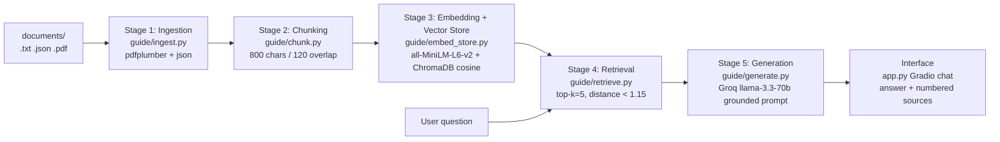

# Project 1 Planning: The Unofficial Guide

> Write this document before you write any pipeline code.
> Your spec and architecture diagram are what you'll use to direct AI tools (Claude, Copilot, etc.) to generate your implementation — the more specific they are, the more useful the generated code will be.
> Update the Retrieval Approach and Chunking Strategy sections if you change your approach during implementation.
> Update this file before starting any stretch features.

---

## Domain

**The Unofficial Guide to the USF Computer Science undergraduate program** — the
student-sourced "tribal knowledge" you can't get from the catalog or an advisor:
which courses are weed-outs, which professors curve or run open-book exams, which
electives are genuinely easy, how to survive a heavy course load, what languages
are taught and in what order, and whether the degree is worth it.

This knowledge is valuable and hard to find through official channels because the
official program page only sells the program — it won't tell you that COP 2510
exams under Dr. Small are open-book, that "no-life-ing" CDA is the realistic path
to a B, or that some single-professor courses are coin-flips on quality. That
advice lives scattered across Reddit threads, Rate My Professors reviews, a
student-run GitHub study-guide repo, and a 4-year plan PDF. Pulling it into one
grounded, citeable Q&A system is the whole point.

---

## Documents

| # | Source | Description | URL or location |
|---|--------|-------------|-----------------|
| 1 | Reddit r/USF | "Program Design COP 3514" — what to study (pointers, linked lists), C prep, CDA 3103 tips | `documents/reddit_cop3514.txt` |
| 2 | Reddit r/USF | "COP 2510 Difficulty" — Dr. Small reviews, open-book programming exams, prep advice | `documents/reddit_cop2510.txt` |
| 3 | Reddit r/USF | "Easiest CS Electives" — Software Systems Dev, Software Engineering, Software Testing | `documents/reddit_easiest_electives.txt` |
| 4 | Reddit r/USF | "How hard are these classes? Will working be too much?" — course-load / time management | `documents/reddit_course_load.txt` |
| 5 | Reddit r/USF | "Program quality and languages?" — Java→C→C++→Python order, dept GPA gate, job outcomes | `documents/reddit_cs_experience.txt` |
| 6 | Reddit r/USF | "Need your opinion" — overall CS program experience, professors, internships | `documents/reddit_program_opinion.txt` |
| 7 | USF.edu | Official BSCS program page — overview, ABET accreditation, career outlook, salaries | `documents/usf_bscs_page.txt` |
| 8 | USF.edu | BSCS 4-Year Plan of Study (PDF) — semester-by-semester course sequence | `documents/usf_cs_plan.pdf` |
| 9 | GitHub | `aeckar/usf-cse-resources` README — student study-guide repo, courses covered, contributors | `documents/github_cse_resources.txt` |
| 10 | GitHub | COP 3514 Exam 1 Review — C fundamentals, cluster access, types, pointers, I/O | `documents/github_cop3514_exam1_review.txt` |
| 11 | Rate My Professors | Export of 8 USF professors (e.g. Kasturi for CDA 3201) with ratings + review text | `documents/dataset_rate-my-professors.json` |

---

## Chunking Strategy

**Chunk size:** 800 characters (~150–200 words)

**Overlap:** 120 characters

**Reasoning:** The corpus is mostly short, conversational units — individual
Reddit comments, Rate My Professors reviews, and bullet-style study-guide
sections. 800 characters is large enough to keep a single comment or review whole
(so the reasoning behind a piece of advice stays attached to the advice itself)
while staying small enough that retrieval stays focused on one opinion rather
than dragging in an entire thread. The 120-character overlap (~15%) prevents a key
sentence — a professor name, a course code, an "open book" qualifier — from being
orphaned exactly at a boundary. Splitting prefers natural boundaries (paragraph,
then sentence/line breaks) so chunks rarely cut mid-thought. A review-heavy corpus
like this warrants smaller chunks than a long structured FAQ would.

---

## Retrieval Approach

**Embedding model:** `all-MiniLM-L6-v2` (384-dim) via `sentence-transformers`,
with an automatic fallback to ChromaDB's `DefaultEmbeddingFunction` (the *same*
all-MiniLM-L6-v2 weights served via ONNX, no PyTorch dependency). Stored in a
local persistent ChromaDB collection using cosine space.

**Top-k:** 5, with a cosine-distance cutoff of 1.15 — chunks looser than that are
dropped so off-topic context never reaches the model.

**Production tradeoff reflection:** all-MiniLM-L6-v2 is the right call here — it's
fast, free, runs locally, and is strong on exactly this kind of short-text
semantic similarity. If cost weren't a constraint and this served real students, I
would weigh a larger embedding model (e.g. OpenAI `text-embedding-3-large` or a
BGE/E5 model):
- **Accuracy on domain-specific text:** larger models capture more nuance, which
  matters when a query like "is the curve generous?" must match comments that
  never use the word "curve."
- **Context length:** MiniLM truncates at 256 tokens, so my 800-char chunks are
  near its ceiling; a longer-context model would let me use bigger chunks without
  silently dropping the tail of a review.
- **Latency & cost:** an API embedder adds network round-trips and per-token cost
  and creates a hard dependency on a provider — a real tradeoff against the
  current zero-cost, offline-capable local setup.
- **Multilingual support:** not needed for an English-only USF corpus, but a
  multilingual model would matter if expanded to international-student forums.

---

## Evaluation Plan

| # | Question | Expected answer |
|---|----------|-----------------|
| 1 | How hard is COP 3514 (Program Design) and what should I focus on to do well? | Moderate — not "tough" but a large volume of material/projects. Focus on **pointers, memory management, and linked lists**; read the textbook + do practice problems; start the weekly projects early. (reddit_cop3514, github_cop3514_exam1_review) |
| 2 | Which professor is best for CDA 3201 (Computer Logic & Design)? | **Rangachar Kasturi** (Computer Science) is the professor reviewed for CDA 3201 in the RMP data — answer should report his rating/sentiment from those reviews. (dataset_rate-my-professors) |
| 3 | Is Dr. Small a good professor for COP 2510, and are her exams open book? | **Yes** — students praise her; she explains code line-by-line. Her **programming exams are open book** (ZyBook/IDE allowed); **midterms are not** (hand-written code on paper). (reddit_cop2510) |
| 4 | What are the easiest CS electives at USF? | **Software Systems Development** (very easy — simple assignments + 2 MC exams), **Software Engineering** (group project, mostly online), and **Software Testing** (no exams, easy assignments). (reddit_easiest_electives) |
| 5 | What programming languages does the USF CS program teach and in what order? | Intro starts in **Python** (formerly Java), then **C** (COP 3514), then **C++**; some electives add **C#/Python**. Order: Python → C → C++. (reddit_cs_experience) |

---

## Anticipated Challenges

1. **Noisy, contradictory opinions.** The program-quality threads swing from
   "rewarding, profs curve hard" to "a travesty, go elsewhere." Retrieval can
   surface only one side, making the answer feel falsely authoritative. Mitigation:
   the system prompt requires attributing claims to students ("students say…") and
   explicitly noting when sources disagree, and top-k=5 pulls multiple viewpoints.

2. **Course/professor identifiers split across chunk boundaries or sources.** A
   professor's name, the course code, and the key qualifier ("open book") can land
   in different chunks, and some entities live only in one source type (Dr. Small
   appears in Reddit, *not* in the RMP JSON; Kasturi is the reverse). Mitigation:
   120-char overlap, professor-level documents in ingestion (one doc per professor),
   and metadata carrying course/professor so citations stay traceable.

3. **Off-topic / low-relevance retrieval.** A vague query could pull weakly related
   chunks. Mitigation: a `MAX_DISTANCE` cutoff (1.15) drops loose matches, and the
   prompt instructs the model to answer "The sources I have don't cover that"
   rather than guess.

---

## Architecture

Pipeline stages: **Document Ingestion → Chunking → Embedding + Vector Store →
Retrieval → Generation**, wired up by `build_index.py` (stages 1–3) and `app.py` /
`evaluate.py` (stages 4–5).

---

## AI Tool Plan

**Milestone 3 — Ingestion and chunking:**
Use Claude (Cursor) with the *Documents* and *Chunking Strategy* sections as
context. Input: the list of source types (.txt with `Title/URL/Source` headers,
the RMP JSON schema, the plan PDF) and the chunk-size/overlap spec. Expected
output: `guide/ingest.py` that normalizes every source type into
`{text, metadata}` (one document per professor for RMP) and `guide/chunk.py`
implementing `chunk_text()` at 800 chars / 120 overlap splitting on natural
boundaries. Verify by running `python -m guide.chunk` and checking the printed
chunk count and min/max/avg sizes match the spec, and spot-checking that a single
review isn't cut mid-sentence.

**Milestone 4 — Embedding and retrieval:**
Give Claude the *Retrieval Approach* section. Input: embedding model name, cosine
space, top-k, and the distance cutoff. Expected output: `guide/embed_store.py`
(ChromaDB persistent client, batched `add`, sentence-transformers→ONNX fallback)
and `guide/retrieve.py` returning ranked `RetrievedChunk`s with distances filtered
by `MAX_DISTANCE`. Verify by running `python build_index.py` then
`python -m guide.retrieve "how hard is COP 3514"` and confirming the top chunks
are on-topic with sensible distances.

**Milestone 5 — Generation and interface:**
Give Claude the *Anticipated Challenges* + grounding requirements. Input: the
"use only the sources, cite by number, attribute to students, say you don't know"
rules and the Groq model choice. Expected output: `guide/generate.py` with a
strict system prompt, numbered `[Source N]` context blocks, and a Groq backend
(Ollama fallback); plus `app.py`, a Gradio interface showing the answer with its
cited sources. Verify by running the 5 evaluation questions via `python evaluate.py`
and checking each answer matches the *Evaluation Plan* expected answers and cites
real sources.
